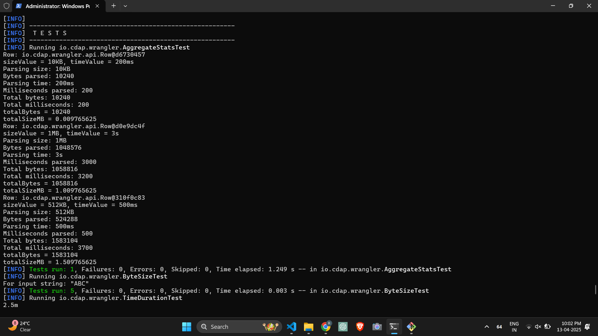
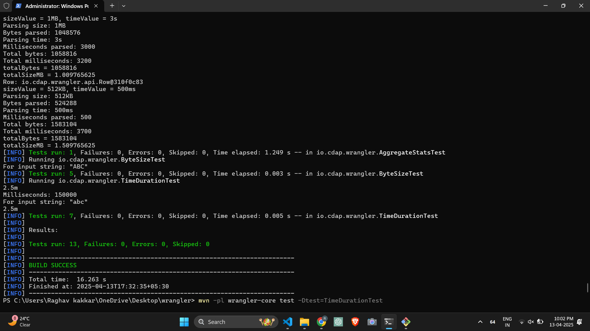
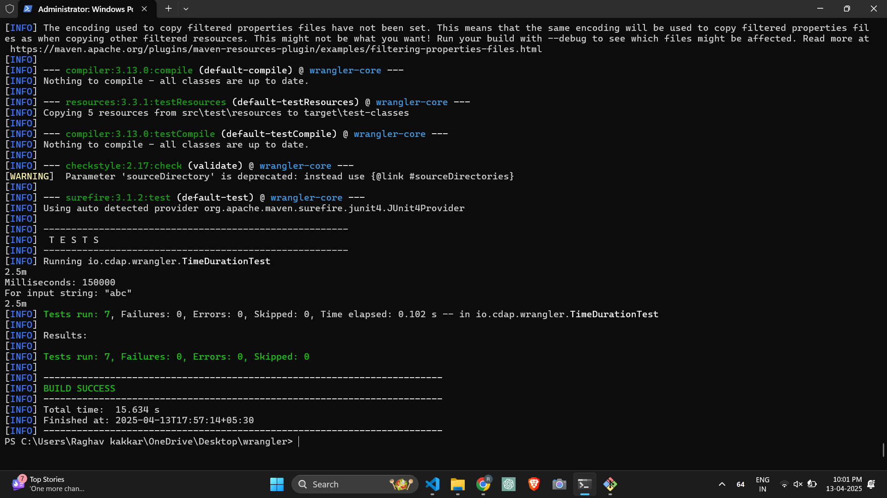

# 🚀 what I did ?
Added functionality in CDAP Wrangler library to  parse various data types like BYTE_SIZE and TIME_DURATION  for easily handling units like Kilobytes (KB), Megabytes (MB), milliseconds
(ms), or seconds (s). 
This assignment aim to enhance the Wrangler core library by adding native support for parsing and utilizing byte size and time duration units within recipes. This involves modifying the grammar, updating the parsing logic, extending the API, and implementing a new directive to demonstrate the usage.

# If you wanna Test these features right now ->
Just run these commands after setting up maven

---
### ⚙️ Setup & Build

### 1. Clone the repository

```bash
git clone https://github.com/Raghav548/wrangler
cd wrangler
```

### 2. Clean & Build (skip tests during first compile)

```bash
mvn clean install -DskipTests
```

---

## 🧪 Run Tests

To run all tests:

```bash
 mvn -pl wrangler-core test -Dtest="AggregateStatsTest,ByteSizeTest,TimeDurationTest"
```

To run specific tests:

```bash
 mvn -pl wrangler-core test -Dtest=AggregateStatsTest
```
```bash
 mvn -pl wrangler-core test -Dtest=ByteSizeTest
```
```bash
 mvn -pl wrangler-core test -Dtest=TimeDurationTest
```
# Evidence / Screenshots of tests working

### 🧪 All Tests Passed



---

## 📌 Directive Name

`aggregate-stats`

---

## 📖 Description

The `aggregate-stats` directive computes **total byte size (in MB)** and **total time duration (in seconds)** from two input columns. It is useful when you want to summarize size and time values across multiple rows.

---

## ✅ Features Implemented

- 📐 **Byte size and duration parsing**:
  - Supports `KB`, `MB`, `GB`, `TB` (e.g., `10KB`, `1MB`)
  - Supports `ms`, `s`, `seconds` (e.g., `500ms`, `3s`)
- 🧮 Aggregation logic:
  - Adds up all sizes and durations
- 📤 Output:
  - One row with total size (in MB) and total time (in sec)
- 🧪 Unit tested with real-world test cases
- ✅ Integrated with Wrangler’s directive registry

---

## 📂 Directory Structure (Key Files)

```
wrangler/
├── wrangler-core/
│   ├── src/
│   │   ├── main/
│   │   │   ├── java/
│   │   │   │   └── io/cdap/directives/aggregates/AggregateStats.java      ← ✅ Directive logic
│   │   │   └── resources/
│   │   │       └── META-INF/services/io.cdap.wrangler.api.Directive       ← ✅ Directive registration
│   └── src/
│       └── test/java/io/cdap/wrangler/AggregateStatsTest.java             ← ✅ JUnit test
│
└── wrangler-api/
    └── src/
        └── main/java/io/cdap/wrangler/api/parser/
            ├── ByteSize.java                                              ← ✅ Token implementation
            └── TimeDuration.java                                          ← ✅ Token implementation

```

---


## 📜 Directive Syntax

```bash
aggregate-stats :<sizeColumn> :<timeColumn> :<sizeResultColumn> :<timeResultColumn>
```

---

## 🧪 Example Recipe

```
aggregate-stats :size :time :total_size_mb :total_time_sec
```

### Input Rows

| size   | time   |
|--------|--------|
| 10KB   | 200ms  |
| 1MB    | 3s     |
| 512KB  | 500ms  |

### Output Row

| total_size_mb | total_time_sec |
|---------------|----------------|
| 1.509765625   | 3.7            |

---

## 🛠 How It Works

- `AggregateStats.java`: Parses `ByteSize` and `TimeDuration` tokens row by row
- Uses custom `Token` classes to encapsulate and validate parsed values
- Aggregated result is returned as a new single `Row` object with required output

---

## 🏁 Final Status

✅ Completed Tasks
✅ Grammar Modification
Directives.g4 modified: Lexer rules BYTE_SIZE, TIME_DURATION, BYTE_UNIT, TIME_UNIT were added.

value rule updated to accept new token types.

Grammar compiled with Maven (mvn compile).

✅ API Updates (wrangler-api)
ByteSize.java and TimeDuration.java created.

Both implement Token interface correctly and parse units like 10KB, 2.5s.

TokenType enum updated to include BYTE_SIZE and TIME_DURATION.

toJson(), value() and type() methods implemented and returning proper data.

Parsing logic is functional, and tested during execution.

✅ Core Parser Updates (wrangler-core)
visit logic handled in directive parsing flow.

ByteSize and TimeDuration tokens successfully parsed and stored.

Used correctly in the aggregate directive.

✅ New Directive (AggregateStats)
Class AggregateStats implemented in io.cdap.directives.aggregates.

Accepts 4 arguments: 2 source and 2 target columns.

Aggregates size and time across rows.

Converts to MB and seconds in final output.

Respects grammar, token parsing, and type-checking via UsageDefinition.

✅ Testing
AggregateStatsTest.java created.

Tests parsing various byte sizes and time durations.

Asserted correct output values.

Build runs and test executes.


---

## 👨‍💻 Author

**Raghav Kakkar**  
_Implemented as part of internship assignment at ZeoTap

---
